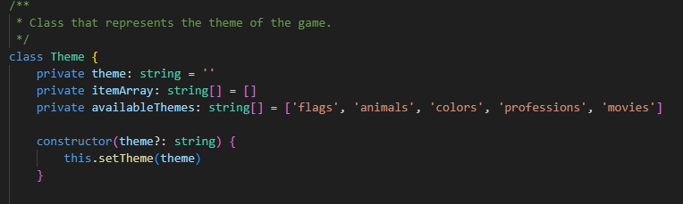
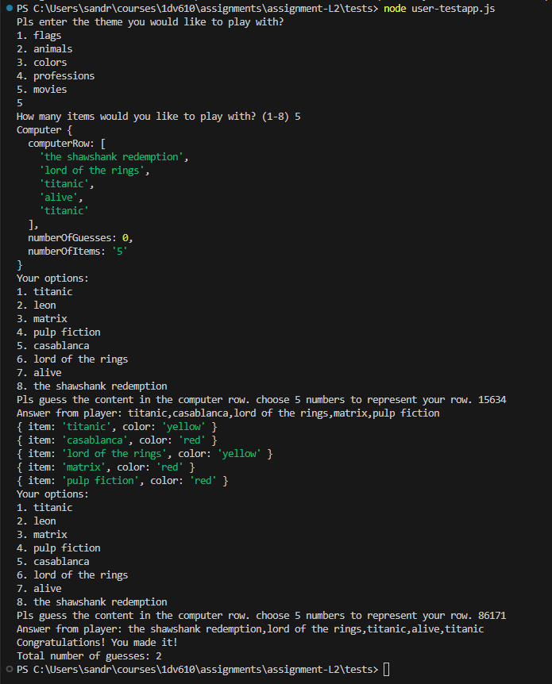

# L2 
### School project in 1dv610

## Overview
This module can be used as part of a game that is similar to Mastermind, but in this game it will be possible to choose between different themes (flags, animals, colors, professions and movies). It is also possible to create a different theme by sending in a theme description together with an array of items. The developer using this module can choose between creating an user interface for a game played in the console or to create a web application.

## Game idea
The idea of the game is that the user should choose a theme that contains 8 items and decide how many items the computer should use in the row. The computer uses the 8 items to create a random row with as many items as the user wanted. It is then up to the user to guess the secret row, by entering a combination of items. If the item is in the correct place it will receive color green. If it is in the wrong place it will receive color yellow and color red will let the user know the the item is not represented in the row. When all items are in the correct place, the game will end and it will be possible to get info regarding how many guesses that the user has used in the game round. 

## Console or Web application

The module can be used to create a console application if the user of this module develops an user interface. Another possibility is to create a web application. One solution would be to use the Item class to create bricks with images of the items. Images of flags are included in the package, but future versions will also include images of other themes. It is also possible to add other images and themes to create an application with the theme of your choise. One suggestion is to use the color of the item to create a border around the item/brick/image to show the player if the item is in the correct place or not.   

## Installation

Enter the folder where you want to store the project and write git clone https://github.com/SanJulin/L2.git to clone the project. 

Install Node.js if it is not already installed. Pls visit Node.js official website for installation info. 

Install Typescript if you it is not already installed, by typing: npm install -g typescript

Navigate to folder L2/tests to see the available tests and check the below testing info for further instructions. 

## Testing
Testing has been done for a previous version of the module (https://github.com/SanJulin/L2/commit/9cd26d3a9dc0b29eba3bfc3a28e57a3ab63ff077)

### Manual testing of the game
Enter node user-testapp.js to manually test the module by playing the game.

### Computer testing of the game
Enter node ai-testapp.js to see the computer AI playing the game.

### Testing of methods
Enter node method-testapp.js to see the test result of Class methods. 

## Programming language 
The module has been written in Typescript and Javascript.

## License
MIT License Copyright (c) 2024 SanJulin

## Dependencies

Node.js

TypeScript

## Version
1.0.0

## Releases
A new release is expected in October, 2024. 

## User contribution
A newer version of the module will soon be released. Pls contribute by letting me know if you discover any bugs or have any ideas on how I can improve the module. 

## Methods

### Theme Methods

#### `getTheme(): string`
Gets the current theme of the game which will be used when the items are created.

#### `setTheme(theme: string) : void`
Sets the theme for the game if the theme string is not empty and calls the setItemArray method.

#### `getAvailableThemes(): string[]`
Gets all the themes available in the current version of the module. 

#### `setItemArray() : void`
Sets the array with items that should be used in the game by checking what the current theme is.  

#### `getItemArray(): object[]`
Gets the current array with items. 

#### `setOtherTheme(theme: string, themeArray: object[]) : void`
Sets the theme and itemArray for other themes than the available themes included in the module. The user of the module must provide a theme name and an array that includes 8 items in order to create a themes of their choice.

#### `createItemArray()`
Creates an array with items based on the provided theme array. 

### Computer Methods

#### `getNumberOfItems() : number`
Gets the number of items that is used in the game. 

#### `setNumberOfItems(numberOfItems: number) : void`
Sets the number of items that should be included in the computer row.

#### `createComputerRow(themeArray: object[]) : void`
Creates a new instance of the ComputerRow class and calls the generateRow method in the ComputerRow class in order to generate a new row that will represent the computer´s row of items.

#### `getComputerRow(): object[]`
Returns an array with the items that represent the current computer row.

#### `getNumberOfGuesses(): number`
Gets the number of guesses used in a playround. 

#### `checkAnswer(answer: object[]): any`
Method that checks if the row of items provided by the user matches the computer´s row by checking if the item and the position of the item is the same. An object is created for each item. If the item is in the correct place - the item will get the color green. If the item is present in the row, but in the wrong place - the item will get the color yellow and the color red will be used for items that are not present in the computer´s row.

### ComputerRow Methods

#### `getNumberOfItems(): number`
Gets the number of items that is included in the computer row.

#### `setNumberOfItems(numberOfItems: number) : void`
Sets the number of items that should be included in the computer row.

#### `setItemArray(itemArray: object[]) : void`
Sets the itemArray if there are 8 items in the provided array.

#### `generateRow(): object[]`
Creates a random row based on the itemArray and returns it to the computer. 

### Item Methods

#### `getName(): string`
Gets the name of the current item used in the game. 

#### `setName(name: string) : void`
Sets the name for the current item that will be used in the game. 

#### `getId(): number`
Gets the id of the current item used in the game.

#### `private setId(id : number) : void`
Sets the id for the current item that will be used in the game.  

#### `getColor(): string`
Gets the color of the current item used in the game.

#### `setColor(color: string) : void`
Sets the color for the current item that is used in the game, depending on if the player has put the item in the correct place (green), the wrong place (yellow) or if the item is not present in the row (red).

## Examples

### Code examples

### Game example

