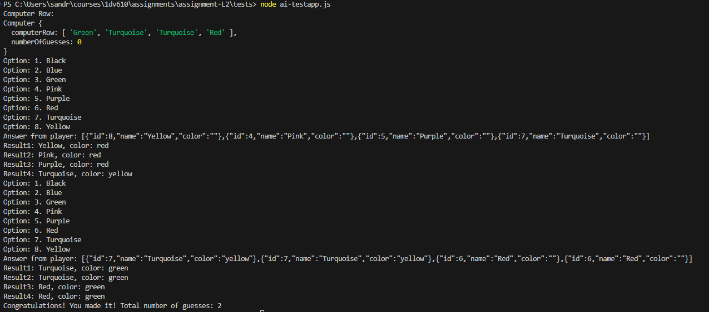

# TestRapport

### Jag har skrivit 3 testfiler för att kunna testa koden på olika sätt. 

## Manuell testning
Skriv node user-testapp.js för att köra en manuell version av spelet där du som användare får testa med olika input. 

### Exempel på utskrift från manuell testning

## Computer AI testning
Skriv node ai-testapp.js för att se en automatisk körning av spelet där en ai agerar user. Observera att AI spelaren i det här fallet inte är så smart så det kan krävas några rundor för att den ska lyckas lista ut vad Computer row innehåller. 

### Exempel på utskrift från automatisk testning med en AI spelare

## Testing of methods
Skriv node method-testapp.js för att se resultatet av separata tester av klassmetoderna. Utfallet syns även nedan. 

