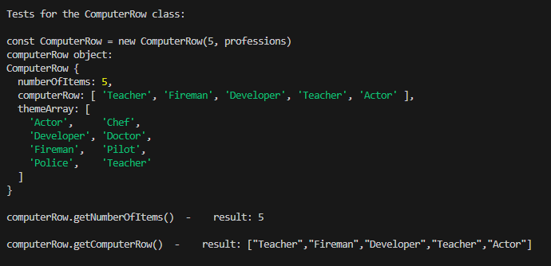
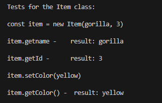

# TestRapport

Jag har skrivit 3 testfiler för att kunna testa koden på olika sätt. 

## Manuell testning
Skriv node user-testapp.js för att köra en manuell version av spelet där du som användare får testa med olika input. 

### Exempel på utskrift från manuell testning

## Computer AI testning
Skriv node ai-testapp.js för att se en automatisk körning av spelet där en ai agerar user. Observera att AI spelaren i det här fallet inte är så smart så det kan krävas några rundor för att den ska lyckas lista ut vad Computer row innehåller. 

### Exempel på utskrift från automatisk testning med en AI spelare

## Testning av metoder
Skriv node method-testapp.js för att se resultatet av separata tester av klassmetoderna. Utfallet syns även nedan.

## Testning av metoder med korrekt input 

### Testning Theme class med korrekt input 

### Testning Computer class med korrekt input 

### Testning ComputerRow class med korrekt input 

### Testning Item class med korrekt input 

## Testning av publika metoder med felaktig input (olika klasser)
_________________________________________________________________________________________________________________
| Method                                     | Expected output                                   | Test result  |
|--------------------------------------------|---------------------------------------------------|--------------|              
| new ComputerRow(9, 'professions')          | Error: Pls provide a number between 2 - 8         | Successful   |
|                                            |                                                   |              |
| item.setColor('purple')                    | Error: Only green, yellow and red are valid colors| Successful   |
|                                            |                                                   |              |
| new Computer(0,'professions')              | Error: Pls provide a number between 2 - 8         | Successful   |
|                                            |                                                   |              |    
| new Theme() + theme.getTheme()             | Error: No theme has been set for the game         | Successful   |
|                                            |                                                   |              |    
