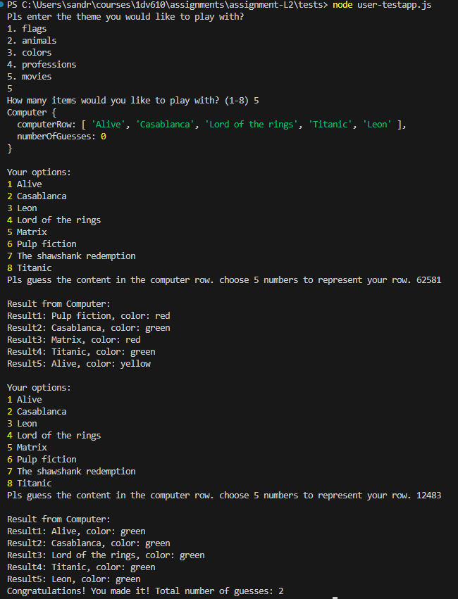

# TestRapport

### Jag har skrivit 3 testfiler för att kunna testa koden på olika sätt. Testningen är gjord på filerna som commitats med texten: "Updating testing files and report". https://github.com/SanJulin/L2/commit/9cd26d3a9dc0b29eba3bfc3a28e57a3ab63ff077. Den versionen ger en lite snyggare utskrift än den senaste versionen. 

## Manuell testning
Skriv node user-testapp.js för att köra en manuell version av spelet där du som användare får testa med olika input. 

### Exempel på utskrift från manuell testning

## Computer AI testning
Skriv node ai-testapp.js för att se en automatisk körning av spelet där en ai agerar user. Observera att AI spelaren i det här fallet inte är så smart så det kan krävas några rundor för att den ska lyckas lista ut vad Computer row innehåller. 

### Exempel på utskrift från automatisk testning med en AI spelare

## Testning av metoder
Skriv node method-testapp.js för att se resultatet av separata tester av klassmetoderna. Utfallet syns även nedan.

## Testning av metoder med korrekt input 

### Testning Theme class med korrekt input 

### Testning Computer class med korrekt input 

### Testning ComputerRow class med korrekt input 

### Testning Item class med korrekt input 

## Testning av publika metoder med felaktig input (olika klasser)
_________________________________________________________________________________________________________________
| Method                                     | Expected output                                   | Test result  |
|--------------------------------------------|---------------------------------------------------|--------------|              
| new ComputerRow(9, [itemArray 8 items])    | Error: Pls provide a number between 1 - 8         | Successful   |
|                                            |                                                   |              |
| new ComputerRow(4, ['pulp fiction'])       | Error: The item array must contain 8 items        | Successful   |
|                                            |                                                   |              |
| item.setColor('purple')                    | Error: The item must have a name                  | Successful   |
|                                            |                                                   |              |
| new Computer(0,[itemArray 8 items])        | Error: Pls provide a number between 1 - 8         | Successful   |
|                                            |                                                   |              |
| new Computer(3, [teacher', 'actor])        | Error: The item array must contain 8 items        | Successful   |
|                                            |                                                   |              |
| computer.setNumberOfItems(9)               | Error: The item array must contain 8 items        | Successful   |
|                                            |                                                   |              |    
| computer.checkAnswer(['police', 'pilot'])  | Error: The guess must contain 3 items.            | Successful   | 
|                                            |                                                   |              |    
| new Theme() + theme.getTheme()             | Error: No theme has been set for the game         | Successful   |
|                                            |                                                   |              |    
| new Theme() + theme.getItemArray()         | Error: ItemArray has not been set                 | Successful   |
|                                            |                                                   |              |    
| theme.setOtherTheme('',[itemArray 8 items])| Error: Pls provide a theme "name" for the game    | Successful   |
|                                            |                                                   |              |    
| theme.setOtherTheme('sports', ['skiing'])  | Error: Error: The themeArray must contain 8 items.| Sucessful    |
|____________________________________________|___________________________________________________|______________|
